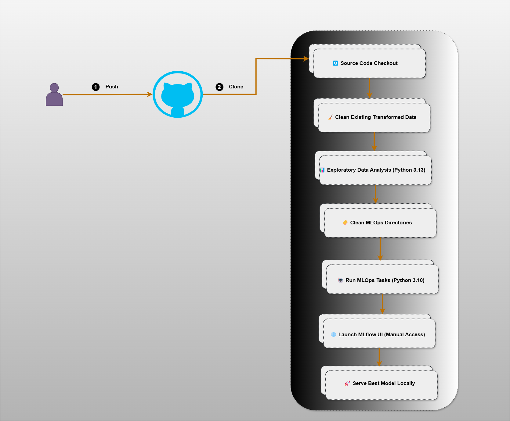

# 🍽️ Prévisions de revenus des restaurants - Pipeline MLOps

Ce projet vise à prédire le **revenu des restaurants** à l'aide de plusieurs modèles de Machine Learning, tout en intégrant une approche **MLOps avec Jenkins, MLflow, et Git**.

---
## 📁 Structure du projet

- PROJET MLOPS/
  - data/
    - train.csv                : Données brutes d'entraînement
    - test.csv                 : Données brutes de test

  - training_data/
    - train_transformed.csv    : Données d'entraînement transformées
    - test_transformed.csv     : Données de test transformées

  - notebooks/
    - resto_revenue_01_analyse.ipynb  : Notebook d’analyse exploratoire
    - resto_revenue_02_model.ipynb    : Notebook de modélisation
    - mlops_tasks.ipynb               : Tâches MLOps avec MLflow
    - best_model/                     : Dossier du meilleur modèle exporté
    - mlruns/                         : Répertoire de logs MLflow

  - jenkinsfile                       : Script de pipeline CI/CD pour Jenkins
  - mlopscicd.drawio.png             : Diagramme de l’architecture MLOps
  - README.md                        : Fichier de documentation

---

## 🚀 Objectifs du projet

- 🧼 Nettoyer et transformer les données pour l'entraînement
- 📊 Réaliser une analyse exploratoire automatique
- 🧠 Tester plusieurs modèles de régression (RandomForest, XGBoost, LightGBM...)
- 🏆 Sélectionner le **meilleur modèle basé sur le RMSE**
- 📦 Logguer les modèles avec **MLflow**
- 🔁 Automatiser le pipeline avec **Jenkins**
- 🌐 Déployer localement le modèle entraîné via `mlflow models serve`

---

## 🛠️ Technologies utilisées

- `Python 3.10 / 3.13`
- `numpy pandas matplotlib seaborn scipy scikit-learn xgboost lightgbm`
- `Jupyter Notebook`
- `MLflow`
- `Jenkins (Pipeline as Code)`

---

## 🔁 Pipeline Jenkins – Présentation des étapes

| 🏷️ Stage Name              | Description                                                                 |
|----------------------------|-----------------------------------------------------------------------------|
| `Checkout`                 | Clone le dépôt GitHub contenant le projet.                                  |
| `Clean data files`         | Supprime les anciens fichiers transformés (`train_transformed.csv`, `test_transformed.csv`). |
| `Data Analysis`            | Exécute le notebook d’analyse exploratoire `resto_revenue_01_analyse.ipynb`.|
| `Clean MLOps`              | Supprime les anciens dossiers `mlruns/` et `best_model/` s’ils existent.    |
| `Train and Log Models`     | Entraîne les modèles, sélectionne le meilleur, et le log dans MLflow.       |
| `Launch MLflow UI`         | Démarre l’interface web de MLflow pour visualiser les expériences.         |
| `Deploy Model Locally`     | Sert le modèle MLflow localement via `mlflow models serve`.                |

---

## 🧭 Diagramme visuel du pipeline

---

## 👨‍💻 Auteur

- **Nom & Prénom :** Mouhamed  Diagne
- **Email :** [diagnem@ept.sn]  
- **GitHub :** [@mouhamed18-48](https://github.com/mouhamed18-48)

Ce projet a été réalisé dans le cadre d'une initiation au MLOps, en intégrant Jenkins pour l'automatisation des étapes clés du cycle de vie d'un modèle Machine Learning.

